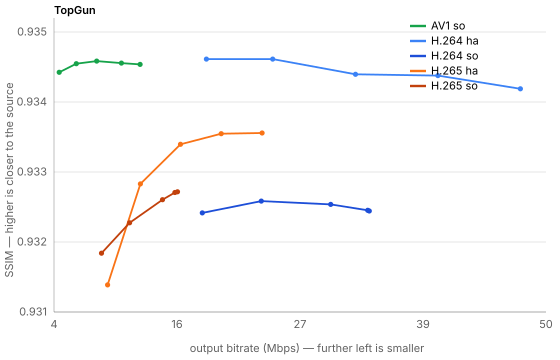
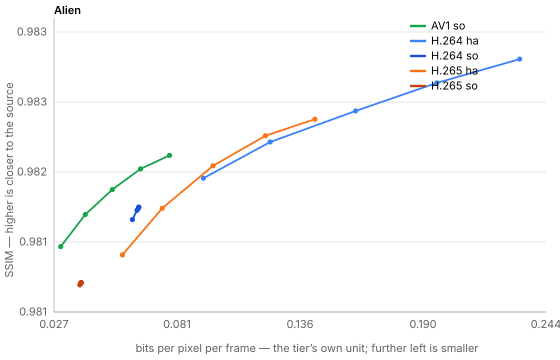
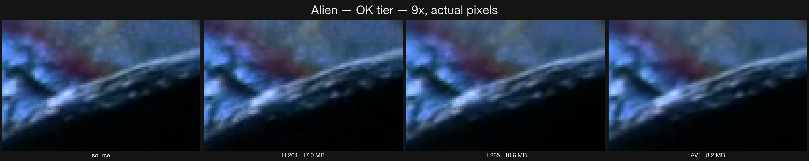
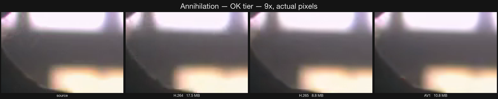

# Encoder comparison — measured, on real films

375 encodes: five sources chosen for variety, three clip lengths from the same
start, every encode path this machine has, every quality tier. The raw table is
`results.csv` beside the samples; the samples themselves are kept so any claim
here can be checked by looking at the file.

| source | frame | codec | bitrate | why it is in the set |
|---|---|---|---|---|
| Yu-Gi-Oh! S01E10 | 1280×720 | h264 | 2.8 Mbps | flat cel animation — the easiest thing to compress |
| Alien (1979) | 1920×800 | h264 | 2.5 Mbps | old, dark, heavy film grain |
| Annihilation (2018) | 1920×1080 | h264 | 3.6 Mbps | modern, colourful, moderate motion |
| Dune Part Two (2024) | 1920×1080 | h264 | 5.6 Mbps | modern, very dark, fine detail |
| Top Gun Maverick (2022) | 3840×2080 | **hevc** | 9.4 Mbps | large modern 4K source |

All measurements are **SSIM against that exact clip**, so "smaller" is never reported
without saying what it cost.

Two conventions, both explained in [quality-model.md](quality-model.md): **bpp is what
was asked for, SSIM is what was got** — a dial and a measurement, not two names for
the same thing; and **a ratio is always `subject ÷ baseline` for a named quantity,
written `×`**, so `size ×0.16` and `speed ×3.2` never disagree about which direction
is which.

---

## 1. What a codec is worth, at matched quality

The useful question is not "how small can it go" but "how small at the same
quality". Taking software H.264 at EXCELLENT as the baseline, and finding the
cheapest encode of each other codec that matches its SSIM:

Sizes are given as `size ×` — the ratio of that codec's bitrate to the H.264
baseline's, at the same measured SSIM. Lower is smaller.

| source | H.264 baseline | H.265 | AV1 |
|---|---|---|---|
| Yu-Gi-Oh! | 1.5 Mbps | — | size ×0.79 |
| Alien | 2.4 Mbps | — | size ×0.46 |
| Annihilation | 2.4 Mbps | size ×0.49 | size ×0.60 |
| Dune Part Two | 2.9 Mbps | size ×0.45 | size ×0.50 |
| **Top Gun (4K)** | 30.1 Mbps | size ×0.38 | **size ×0.16** |

The gain is not a constant — it depends on the content far more than on the
codec's reputation. Flat animation barely rewards a modern codec (AV1 at size ×0.79);
a 4K live-action source rewards it enormously (AV1 matches H.264 at size ×0.16 — a
sixth of the bitrate for the same measured quality). The dashes are cases where H.265 never reached the baseline
within the tier range, which is itself worth knowing.

Plotted against **bpp**, so the horizontal axis is the tier's own unit:

---

## 2. What it actually looks like

The same block of pixels, at 9× with nearest-neighbour scaling, so this is real
pixel structure rather than a resampled impression of it. The region is chosen by
measurement — the busiest, well-lit block in the frame — because a flat or dark
area is where every codec looks identical and proves nothing.

**Alien, OK tier** — the grain is the story. H.264 keeps most of it, H.265 smooths
it, AV1 smooths it further and spends the saved bits elsewhere:

Whether that smoothing is a loss or a gain is a matter of taste, and it is
precisely the judgement SSIM cannot make for you — which is why the samples are
kept rather than only the numbers.

---

## 3. Speed, and a model that turns out to be wrong

VTC's time estimates assume encoding cost scales with **output pixel-frames**, so
that a rate measured on one file predicts another. Measured across resolutions,
normalised to 1080p30:

Rates are × realtime normalised to a 1080p30 frame. The last column is `speed ×` —
the 4K rate divided by that same encoder's 1080p rate, so `×1.00` would mean the unit
works and the frame size does not matter.

| path | 1080p sources | Top Gun (4K) | speed × at 4K |
|---|---|---|---|
| H.264 hardware | 7.5 | 8.03 | ×1.07 |
| H.265 hardware | 7.3 | 8.04 | ×1.10 |
| H.264 software | 4.0 | 2.06 | ×0.52 |
| H.265 software | 2.2 | 0.78 | **×0.35** |

**Hardware amortises larger frames well — 4K is its fastest case.** Software
collapses: `libx265` on 4K runs at a third of its per-pixel rate on 1080p, almost
certainly memory bandwidth rather than arithmetic.

Two consequences for the app:

- the pixel-frame work model **under-predicts software 4K encoding by 2–3×**, and
- a benchmark cannot sample cheap 1080p files and extrapolate to a 4K library.

There is also a reversal worth knowing: on 1080p, SVT-AV1 is the slowest path
here. On 4K it is the faster of the two — 80s against x265's 255s for the same clip,
speed ×3.2 — *and* produced a smaller file at higher SSIM. Codec speed rankings do not
survive a change of resolution.

---

## 4. How long a sample has to be

This is what the whole matrix was built to answer. Taking the 60-second clip as
the reference and asking how far the shorter ones are from it, across 118 cells:

Error is stated as a percentage because it is a share of one named whole — the 60s
reading — not a comparison between two things.

| | median error | 90th percentile | worst |
|---|---|---|---|
| 10s vs 60s | **10.9%** | 27.5% | 38.5% |
| 30s vs 60s | **2.6%** | 12.8% | 26.8% |

A ten-second sample is not a measurement. It is worst on `libx265`
(median 21.6%, worst 35.2%) — the most analysis-heavy encoder needs the most
frames before its rate control settles — and short clips read systematically
**slow** (−4.9%), which is start-up cost being counted as throughput.

**So the benchmark's floor is 30 seconds, and 60 is better.** An earlier idea —
shortening 4K samples to keep the cost down — would have pushed exactly into the
unreliable zone, and was abandoned on this evidence.

---

## 5. Where SSIM stops helping

On Top Gun, SSIM sits near 0.934 and **stops responding to bitrate**: H.264
hardware scores 0.9344 at 18.5 Mbps and 0.9339 at 47.7 Mbps — slightly *worse* for
two and a half times the data. Frame counts were checked and align exactly, so
this is not a measurement artefact.

The explanation is the grain. It is high-entropy and effectively noise; no
bitrate reproduces it exactly, and SSIM penalises any difference without caring
whether the result looks better. So on grainy 4K, **SSIM saturates before quality
does**, and the tier ladder looks flat when it is not.

That is a limit of the metric, not of the encoders — and the reason this document
shows crops as well as numbers.
